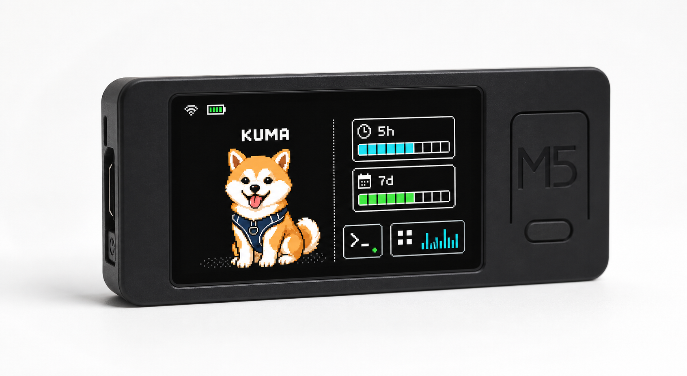
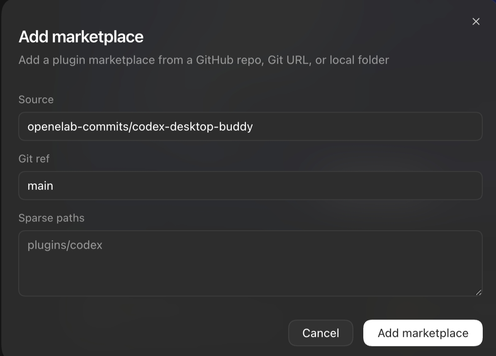
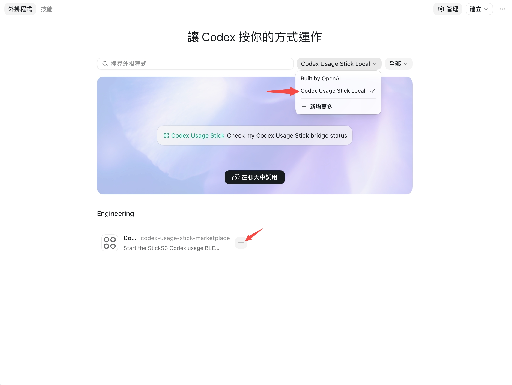

# Agent Desktop Pets

Agent Desktop Pets is a firmware and local agent bridge for turning an
M5Stack StickS3 into a tiny desktop companion for AI coding agents.

The StickS3 shows live agent state over BLE: a GIF pet, a 5-hour usage bar, a
7-day usage bar, reset countdowns, and state-driven animations such as `busy`,
`idle`, `completed`, `attention`, `dizzy`, `heart`, and `sleep`.

This project is a fork of Anthropic's
[`claude-desktop-buddy`](https://github.com/anthropics/claude-desktop-buddy)
reference firmware. The BLE display idea comes from that reference project,
but this fork is focused on Codex, M5Stack StickS3, GIF pets, and a local Codex
usage bridge. It also adds a converter for Codex app pets so `hatch-pet` style
atlases can run on the hardware display.

<p align="center">
  
</p>

The image above is an original Kuma interface concept generated for this fork,
not an inherited screenshot from the upstream desktop buddy repository.

## What It Displays

- GIF pet area.
- `CODEX USAGE` header with `LIVE` or `WAIT`.
- Primary usage window labeled `5h`.
- Secondary usage window labeled `7d`.
- Reset countdowns for both windows.
- Color-coded usage bars:
  - `0-34%`: blue
  - `35-69%`: green
  - `70-100%`: orange
- Color-coded reset time values:
  - `5h`: green above 3h, orange above 1h, red at 1h or below
  - `7d`: green above 4d, orange above 2d, red at 2d or below

Portrait mode places the pet above the usage bars. Landscape mode places the
pet on the left and usage bars on the right.

## Hardware

Tested target:

```text
M5Stack StickS3 / ESP32-S3
```

## Quick Start

For a full walkthrough, use [docs/USAGE.md](docs/USAGE.md).
Remember to install PlatformIO before building or flashing the firmware.

### 1. Build And Flash Firmware

```bash
git clone https://github.com/YaoYao021123/agent-desktop-pets.git
cd agent-desktop-pets
pio run -e m5stack-sticks3
pio run -e m5stack-sticks3 -t upload
pio run -e m5stack-sticks3 -t uploadfs
```

When flashing firmware or uploading filesystem data, hold the lower-left side
button to enter flashing mode. Short-press twice to power off, and short-press
once to power on.

### 2. Install The Codex Plugin

Install Python BLE support:

```bash
python3 -m pip install bleak
```

In Codex, open:

```text
Settings -> Plugins -> Add plugin marketplace
```

Fill the dialog like this:

```text
Source:
YaoYao021123/agent-desktop-pets

Git ref:
main
```

<p align="center">
  
</p>

Choose `Codex Usage Stick Local` and add it.

<p align="center">
  
</p>

If you publish this under your own fork, use your own GitHub `owner/repo` in
the `Source` field.

Open a new Codex window, type `$codex-usage-stick`, choose the plugin skill,
and send this prompt:

```text
Help me enable hooks and generate three corresponding hooks: SessionStart, UserPromptSubmit, and PermissionRequest. They need to be triggered both inside and outside the project.
```

Codex should create the three hooks that start the BLE bridge.

CLI fallback:

Make plugin_hooks = true on bash:

```bash
/Applications/Codex.app/Contents/Resources/codex features list | grep plugin_hooks
```

if it turns out:
```bash
plugin_hooks    under development    true
```
plugin_hooks = true, if not
Enable plugin hooks on bash:

```bash
/Applications/Codex.app/Contents/Resources/codex features enable plugin_hooks
```


 Confirm the plugin is enabled:

```bash
grep -n 'codex-usage-stick' ~/.codex/config.toml
```
Normally turn out:
```bash
[plugins."codex-usage-stick@codex-usage-stick-marketplace"]
enabled = true
```

If the plugin does not enable automatically, add this to `~/.codex/config.toml`:

```bash
open -a TextEdit ~/.codex/config.toml
```

add this at the end:

```toml
[plugins."codex-usage-stick@codex-usage-stick-marketplace"]
enabled = true
```

Restart Codex. When Codex asks whether to trust the hooks, approve them. The
hooks start a local BLE bridge and forward permission prompts to the StickS3;
they do not send data to an external server.

```bash
/Applications/Codex.app/Contents/Resources/codex plugin marketplace add YaoYao021123/agent-desktop-pets --ref main
```

### 3. Trigger The Bridge

After Codex restarts, make sure Bluetooth is enabled on the computer.
Send any message in Codex. Codex will try to connect to the hardware and the
StickS3 should show a pairing code.

CLI fallback:

For the first BLE pairing on a new computer, start with a foreground `busy`
test so macOS can show the pairing prompt:

```bash
python3 ~/.codex/plugins/cache/codex-usage-stick-marketplace/codex-usage-stick/0.4.0/scripts/codex_usage_ble_bridge.py --verbose --state busy
```

The StickS3 should show a pairing code. Enter that code on the computer to
finish the BLE pairing. Once the hardware starts showing usage information,
stop the foreground test with `Command-C` / `Ctrl-C`.

Then submit any prompt in a project where the plugin hook is trusted. The
plugin hook should start the BLE bridge automatically.

Check hook startup:

```bash
tail -n 20 ~/.codex/codex-usage-bridge/hook.log
```

You should see `UserPromptSubmit`.

When Codex asks for a permission approval, the StickS3 should show an approval
panel. Press A to allow or B to deny. If the StickS3 is offline, Codex falls
back to the normal local approval prompt.

Check BLE packets:

```bash
tail -n 40 ~/.codex/codex-usage-bridge/bridge.log
```

A healthy log contains lines like:

```text
sent {"state":"busy","tokens":...,"primary":...,"secondary":...}
```

### 4. Move The Stick To Another Computer

The StickS3 connects over BLE, not Wi-Fi. To move the same StickS3 to another
computer, first stop the bridge on the old computer or quit Codex:

```bash
cd agent-desktop-pets
python3 plugins/codex-usage-stick/scripts/start_bridge.py --stop
```

Then open Codex on the new computer, install and trust the plugin, and submit
any prompt. The `UserPromptSubmit` hook starts the local BLE bridge and connects
to the StickS3.

If it does not connect, restart the StickS3 and check the new computer's bridge
log:

```bash
tail -n 80 ~/.codex/codex-usage-bridge/bridge.log
```

A StickS3 should be connected to one computer at a time. If the old computer is
still running the bridge, the new computer may see the device but fail to claim
the BLE connection.

## Current Status

This is a working prototype.

Tested:

- M5Stack StickS3 firmware build and upload.
- BLE advertising as `Codex-XXXX`.
- Codex usage packets sent from macOS to StickS3.
- Portrait usage dashboard.
- Landscape usage dashboard.
- Landscape GIF rendering through a small canvas to avoid slow direct LCD
  pixel drawing.
- Local Codex plugin startup on `SessionStart` and `UserPromptSubmit`.
- Local Codex `PermissionRequest` hook forwarding to StickS3.
- StickS3 approve/cancel handling for Codex permission prompts.
- Hook diagnostics and bridge diagnostics.

Testing:

- A polished public pet-generation pipeline. GIF pet creation is still a work
  in progress.

## Packet Format

The bridge sends compact JSON over BLE:

```json
{
  "state": "busy",
  "tokens": 57832,
  "primary": 1,
  "secondary": 16,
  "primary_resets_at": 1778673005,
  "secondary_resets_at": 1779159360,
  "now": 1778671200
}
```

| Field | Meaning |
| --- | --- |
| `state` | Pet state: `busy`, `idle`, `completed`, `attention`, `dizzy`, `heart`, or `sleep` |
| `tokens` | Total token usage value read by the bridge |
| `primary` | 5-hour usage percentage |
| `secondary` | 7-day usage percentage |
| `primary_resets_at` | Unix timestamp for primary reset |
| `secondary_resets_at` | Unix timestamp for secondary reset |
| `now` | Sender timestamp |

## GIF Character Pack Format

A character pack is a folder containing `manifest.json` and GIF files.

Pet state meanings:

| State | Meaning |
| --- | --- |
| `sleep` | Codex has not been used for a long time |
| `idle` | Normal state |
| `busy` | Codex is running |
| `attention` | Codex sent a permission request |
| `completed` | Task completed |
| `celebrate` | Reserved for pet upgrades; currently not called |
| `dizzy` | Triggered by shaking the device |
| `heart` | Triggered by pressing B on the normal screen |

Example:

```json
{
  "name": "Mao",
  "states": {
    "sleep": "sleep.gif",
    "idle": ["idle_0.gif", "idle_1.gif"],
    "busy": "busy.gif",
    "attention": "attention.gif",
    "completed": "completed.gif",
    "celebrate": "celebrate.gif",
    "dizzy": "dizzy.gif",
    "heart": "heart.gif"
  }
}
```

Place character folders under `data/characters/`, for example:

```text
agent-desktop-pets/data/characters/Mao/
```

To update the pet assets, open Terminal in the `agent-desktop-pets` directory
and run:

```bash
pio run -e m5stack-sticks3 -t uploadfs
```

When flashing firmware or uploading filesystem data, hold the lower-left side
button to enter flashing mode. Short-press twice to power off, and short-press
once to power on.

Recommended source animation target:

- 144x156 frames.
- Transparent background.
- Consistent character design across all states.
- No text, UI elements, shadows, or complex scenery inside the GIF.
- Keep the pack small enough for LittleFS.

## Troubleshooting

Use the full guide in [docs/USAGE.md](docs/USAGE.md#troubleshooting).

Common checks:

```bash
python3 plugins/codex-usage-stick/scripts/start_bridge.py --status
tail -n 20 ~/.codex/codex-usage-bridge/hook.log
tail -n 40 ~/.codex/codex-usage-bridge/bridge.log
```

If Codex shows a hook warning about async hooks, update to this version. The
plugin hooks in this repo are synchronous and quickly start a background bridge.

If first-time Bluetooth pairing fails, or the bridge log shows
`Peer removed pairing information`, reset the macOS BLE pairing record:

1. Open macOS `System Settings -> Bluetooth`.
2. Find the `Codex-XXXX` device and choose `Forget This Device`.
3. Turn Mac Bluetooth off and on again.
4. Restart the StickS3.
5. Submit a prompt in Codex to let the plugin reconnect.

## Credits

Maintained as Agent Desktop Pets by YaoYao + Codex.

Forked from the Claude Desktop Buddy reference firmware by Felix Rieseberg and
Anthropic.

## License

This fork keeps the upstream project license. See [LICENSE](LICENSE).
